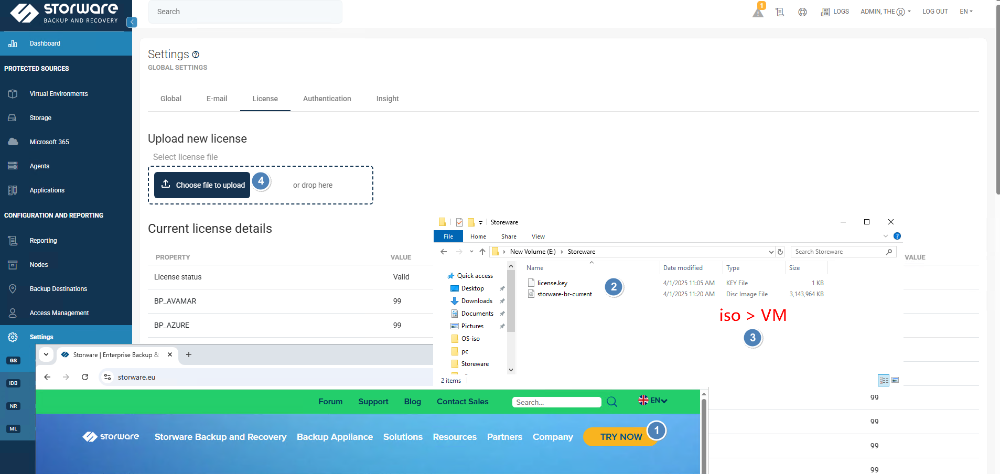

Storeware  

https://storware.eu   TRY NOW 填資料獲取iso 載點與郵件會收到license.key 60天Trial  
all-in-one VM 規格  10 vCPU , 12 GB memory , Disk1 30 GB , Disk2 200GB up視需要 , nic x1   
iso 開機安裝 , 改IP 
https://ip-address   admin/密碼是vPr0tect   , console/ssh root/密碼是vPr0tect 

[root@storware-backup-and-recovery /]# ls -lat 
total 24
drwxr-xr-x.   8 vprotect vprotect   96 Apr  1 10:53 vprotect_data 

 /]# ls -l /vprotect_data/ 

drwxr-xr-x. 2 vprotect vprotect  20 Apr  1 09:30 backups  本身就會建 
drwxr-xr-x. 3 vprotect vprotect  44 Apr  1 10:08 hyperv   這是後來透過configuration wizard  所產生的目錄 , 本例用於local filesystem 
drwxr-xr-x. 2 vprotect vprotect   6 Apr  1 10:38 import   還原時的stage會放在這 
drwxr-xr-x. 2 vprotect vprotect  20 Apr  1 10:53 proxmox  這是後來透過configuration wizard  所產生的目錄 , 本例用於local filesystem 
drwxr-xr-x. 4 vprotect vprotect 124 Apr  1 10:57 staging  備份時的stage會放在這 
drwxr-xr-x. 3 vprotect vprotect  63 Apr  1 09:55 vcenter01 這是後來透過configuration wizard  所產生的目錄 , 本例用於local filesystem 
如果是放於本地考量 ? 空間要夠 , 另外 staging 也要考量空間 詳storware sizer  
過程中如果要觀查stage空量 可以watch -d /vprotect_data/staging   
純storware可以備的來源

