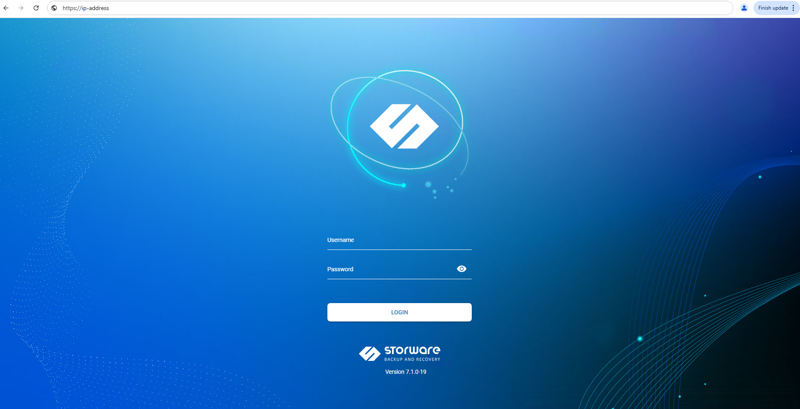
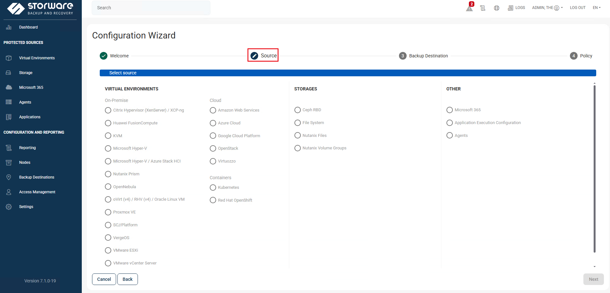

Storware  

https://storware.eu   TRY NOW 填資料獲取iso 載點與郵件會收到license.key 60天Trial  
all-in-one VM 規格  10 vCPU , 12 GB memory , Disk1 30 GB , Disk2 200GB up視需要 , nic x1   
iso 開機安裝 , 改IP 
https://ip-address   admin/密碼是vPr0tect   , console/ssh root/密碼是vPr0tect 

[root@storware-backup-and-recovery /]# ls -lat 
total 24
drwxr-xr-x.   8 vprotect vprotect   96 Apr  1 10:53 vprotect_data 

 /]# ls -l /vprotect_data/ 

drwxr-xr-x. 2 vprotect vprotect  20 Apr  1 09:30 backups  本身就會建 
drwxr-xr-x. 3 vprotect vprotect  44 Apr  1 10:08 hyperv   這是後來透過configuration wizard  所產生的目錄 , 本例用於local filesystem 
drwxr-xr-x. 2 vprotect vprotect   6 Apr  1 10:38 import   還原時的stage會放在這 
drwxr-xr-x. 2 vprotect vprotect  20 Apr  1 10:53 proxmox  這是後來透過configuration wizard  所產生的目錄 , 本例用於local filesystem 
drwxr-xr-x. 4 vprotect vprotect 124 Apr  1 10:57 staging  備份時的stage會放在這 
drwxr-xr-x. 3 vprotect vprotect  63 Apr  1 09:55 vcenter01 這是後來透過configuration wizard  所產生的目錄 , 本例用於local filesystem 
如果是放於本地考量 ? 空間要夠 , 另外 staging 也要考量空間 詳storware sizing guide  https://docs.storware.eu/deployment/sizing    
過程中如果要觀查stage空量 可以watch -d /vprotect_data/staging   
純storware可以備的來源,dell-vProtect有不一樣

/########容量考量
Storware vProtect requires disk space for two primary functions: the operating system and installation (around 20 GB) and the staging space. The staging space, typically mounted at /vprotect_data, needs to be large enough to handle simultaneous backups, so a good rule of thumb is to calculate (size of the biggest VM) * (number of parallel backup threads).
1. OS and Installation Space
Purpose: This space is for the operating system and the Storware Backup and Recovery software itself.
Requirement: A minimum of 20 GB of free disk space is recommended for this purpose.
2. Staging Space (Data Staging)
Purpose: This is a temporary area where data is exported and stored before being sent to the final backup destination.
Calculation: The required size depends on the number of concurrent backup operations and the size of the biggest virtual machine.
Formula: (Size of the biggest virtual machine) x (Number of parallel backup threads).
Example: If your biggest VM is 100 GB and you expect 6 parallel backup threads, you would need approximately 600 GB of staging space.
Configuration: In most installations, the staging area is mounted at the /vprotect_data folder.
Key Considerations
Concurrent Operations: The more concurrent backups you run, the more staging space you'll need.
VM Size: The size of your largest VM is a critical factor in determining staging space requirements.
Integrated Destinations: If your staging area is the same as your backup destination (e.g., using a PowerProtect DD), you can achieve more efficient "store" processing without needing separate storage for staging.
Default Location: The default location for staging space is /vprotect_data, and it's generally not recommended to change this.
/########容量考量

/vprotect_data/這個目錄空間要夠大 預設是與 / 同層   但如不調整一定會爆 , 所以最好自已mount一塊夠大的空間

vprotect 建立目錄  mkdir nutanix-1720
chown vprotect:vprotect nutanix-1720
chmod 0775 nutanix-1720/

#vprotect  for nutanix appliance (base on Centos)安裝boostFS rpm
rpm -ivh DDBoostFS-7.13.1.20-1149144.rhel.x86_64.rpm
vprotect WEB UI > Backup Destinations > +Create  > File System (synthetic) DD Boost
Host DD-ip-address
Account name: DD建一個vprotect 帳號 Storage Unit name:nutanix-1820
Path: 這裡指的是在vprotect的路徑 /vprotect_data/nutanix-1720

62  /opt/emc/boostfs/bin/boostfs lockbox set -d 192.168.55.32 -u vprotect -s nutanix-1720
重開機之後會不見, 要寫到開機啟動 
63  /opt/emc/boostfs/bin/boostfs mount -o allow-others=true -d 192.168.55.32 -s nutanix-1720 /vprotect_data/nutanix-1720
>>Summit ok 

接下來去確認   /vprotect_data/nutanix-1720  chown 
先去 DD 看 vprotect UID GID

#vprotect Virtual Environments > Virtualization Providers對於 Nutanix CE 無效

#### 重裝一台新的vProtect 並移轉過去
    8  nmtui
    9  ip a
   10  ping 192.168.236.254
   11  exit
   12  find /opt/vprotect -name "*.properties" -o -name "*.conf" | xargs du -h
   13  cat /opt/vprotect/server/quarkus.properties | grep "datasource"
   14  systemctl stop vprotect-server vprotect-node
   15  # 假設您的備份檔在 /tmp/vprotect_db.sql.gz
   16  gunzip < /tmp/vprotect_db.sql.gz | mysql -u vprotect -pbws9AgS3nxVIk8iG67UfBmySc45fq6Yr vprotect
   17  # 清理 Quarkus/Server 運行時產生的暫存
   18  sudo rm -rf /opt/vprotect/server/work/*
   19  sudo rm -rf /opt/vprotect/server/tmp/*
   20  # 啟動服務
   21  sudo systemctl start vprotect-server vprotect-node
   22  pvcreate /dev/sdb
   23   vgextend cs /dev/sdb
   24   lvextend -l +100%FREE /dev/cs/root
   25   xfs_growfs /
   26   df -h
   27  cd /vprotect_data/
   28  ls -lat
   29  mkdir backup
   30   chown vprotect -R backup/
   31   chgrp -R vprotect:vprotect backup
   32   chown -R vprotect:vprotect backup
   
   37  rpm -ivh DDBoostFS-7.13.1.40-1186210.rhel.x86_64.rpm
   38   /opt/emc/boostfs/bin/boostfs lockbox set -d 192.168.236.50 -u vprotect0120 -s vprotect0120
   39   /opt/emc/boostfs/bin/boostfs mount -o allow-others=true -d 192.168.236.50 -s vprotect0120 /vprotect_data/backup
   40  df -h

  〉〉進去UI WEB確認有restore db ok , 接著在backup desination  >>> dd > Reinitialized 

  >> 試著 reinventory , 

  >>接著試跑 Backup-policy 有沒有錯誤
>  >
>  >

 
