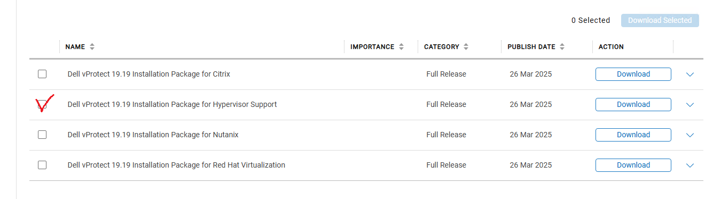

# vProtect for Dell DPS
vProtect Installation and User Guide Version 19.18 November 2024  
vProtect (server and node) Medium on RHEL 8.8 4 vCPU 8G RAM  
Log in as root over SSH to the machine where you want to install it 
RHEL 8/9 requires active subscription 
RHEL#   subscription-manager register --username yourmailaddress@domain --password yourpassword --auto-attach 
Download the vProtect package from the Dell Online Support download page 
vprotect-19.19.0.710.tgz  

#Rocky linux 8.10 

##20260213 note for vprotect node 

 pvcreate /dev/sdb
   22  vgextend cs /dev/sdb
   23  lvextend -l +100%FREE /dev/cs/root
   24  xfs_growfs /
   25  df -h

   31  chown vprotect -R backup/

   38  chgrp -R vprotect:vprotect backup
    
   40  chown -R vprotect:vprotect backup

        rpm -ivh DDBoostFS-7.13.1.40-1186210.rhel.x86_64.rpm 
   90  /opt/emc/boostfs/bin/boostfs lockbox set -d 192.168.236.50 -u vprotect0120 -s vprotect0120       #ip address is dd mgmt ip addr , vprotect0120 is created boost mtree
   91  /opt/emc/boostfs/bin/boostfs mount -o allow-others=true -d 192.168.236.50 -s vprotect0120 /vprotect_data/backup  # /vprotect_data/backup  is mounted for backup data via ddboot 

